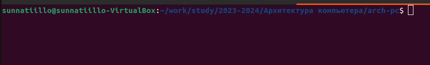
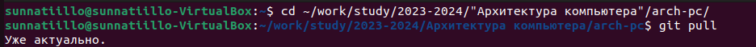
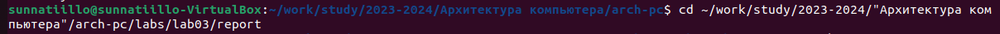
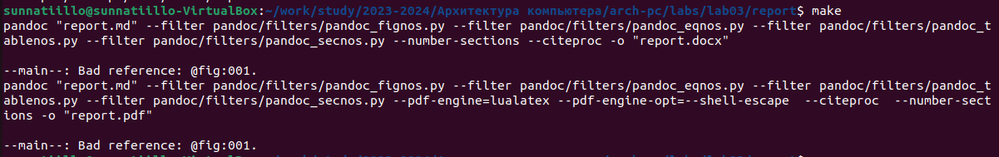
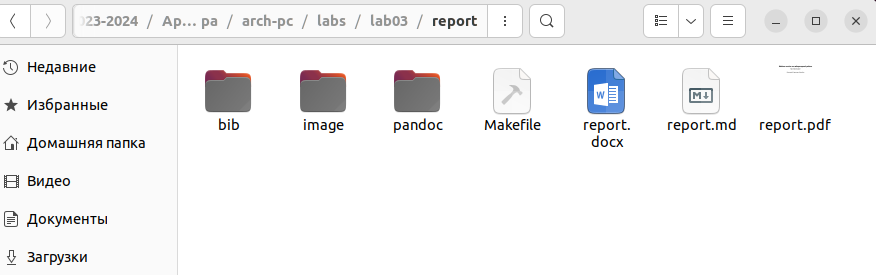
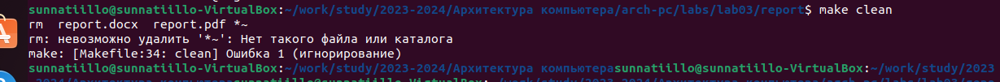
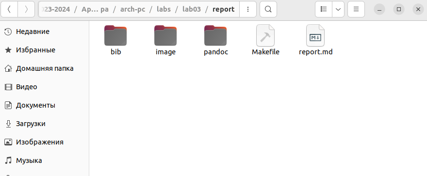
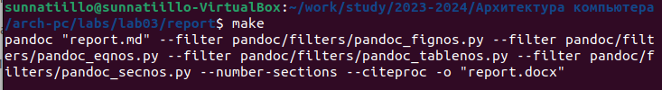
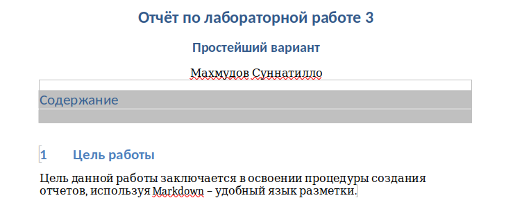

---
## Front matter
title: "Отчёт по лабораторной работе #3"
subtitle: "Простейший вариант"
author: "Махмудов Суннатилло"

## Generic otions
lang: ru-RU
toc-title: "Содержание"

## Bibliography
bibliography: bib/cite.bib
csl: pandoc/csl/gost-r-7-0-5-2008-numeric.csl

## Pdf output format
toc: true # Table of contents
toc-depth: 2
lof: true # List of figures
lot: true # List of tables
fontsize: 12pt
linestretch: 1.5
papersize: a4
documentclass: scrreprt
## I18n polyglossia
polyglossia-lang:
  name: russian
  options:
	- spelling=modern
	- babelshorthands=true
polyglossia-otherlangs:
  name: english
## I18n babel
babel-lang: russian
babel-otherlangs: english
## Fonts
mainfont: PT Serif
romanfont: PT Serif
sansfont: PT Sans
monofont: PT Mono
mainfontoptions: Ligatures=TeX
romanfontoptions: Ligatures=TeX
sansfontoptions: Ligatures=TeX,Scale=MatchLowercase
monofontoptions: Scale=MatchLowercase,Scale=0.9
## Biblatex
biblatex: true
biblio-style: "gost-numeric"
biblatexoptions:
  - parentracker=true
  - backend=biber
  - hyperref=auto
  - language=auto
  - autolang=other*
  - citestyle=gost-numeric
## Pandoc-crossref LaTeX customization
figureTitle: "Рис."
tableTitle: "Таблица"
listingTitle: "Листинг" 
lofTitle: "Список иллюстраций"
lotTitle: "Список таблиц"
lolTitle: "Листинги"
## Misc options
indent: true
header-includes:
  - \usepackage{indentfirst}
  - \usepackage{float} # keep figures where there are in the text
  - \floatplacement{figure}{H} # keep figures where there are in the text
---

# Цель работы

Цель данной работы заключается в освоении процедуры создания отчетов,
используя Markdown – удобный язык разметки.

# Задание

Открыли терминал (см. рис. @fig:001).

{#fig:001 width=70%}

Перешли в каталог курса сформированный при выполнении лабораторной
работы #2, используя команду cd (Рис. 2). Обновили локальный репозиторий,
скачав изменения из удаленного репозитория с помощью команды git pull .
все актуально. (см. рис. @fig:002).

{#fig:002 width=70%}

Перешли в каталок с шаблоном отчета по лабараторной работе

{#fig:003 width=70%}

Проведем компиляцию шаблона с использованием Makefile. Для этого введем
команду make (см. рис. @fig:004).

{#fig:004 width=70%}

Сгенерировались файлы report.pdf и report.docx, что доказывает их появление
в папке (см. рис. @fig:005).

{#fig:005 width=70%}

Удалим полученный файл с использованием Makefile, с использованием ко-
манды make clean (см. рис. @fig:006).

{#fig:006 width=70%}

Проверим удаление файла в папке (см. рис. @fig:007). 

{#fig:007 width=70%}

Откроем файл report.md c помощью текстового редактора gedit (см. рис. @fig:008).

Открытие файла (см. рис. @fig:008).

Задания 7, 8 лабораторной работы соотвествуют заданиям самостоятельной
работы, так что все последующие действия будут представлены в следующем
разделе.

Задания для самостаятельной работы.

В соответствующем каталоге создадим отчёт по лабораторной работе № 2 в
формате Markdown. Отчет создадим 3 форматах: pdf, docx и md  (см. рис. @fig:009).

{#fig:009 width=70%}

{#fig:0010 width=70%}

# Теоретическое введение

Markdown - легковесный язык разметки, созданный с целью обозначения форматирования в простом тексте, с максимальным сохранением его читаемости человеком, и пригодный для машинного преобразования в языки для продвинутых публикаций. Внутритекстовые формулы делаются аналогично формулам LaTeX. В Markdown вставить изображение в документ можно с помощью непосредственного указания адреса изображения. Синтаксис Markdown для встроенной ссылки состоит из части [link text], представляющей текст гиперссылки, и части (file-name.md) – URL-адреса или имени файла, на который дается ссылка. Markdown поддерживает как встраивание фрагментов кода в предложение, так и их размещение между предложениями в виде отдельных огражденных блоков. Огражденные блоки кода — это простой способ выделить синтаксис для фрагментов кода.

# Выводы

Результатом данной лабораторной работы, является освоение процедуры со-
здания отчетов, используя Markdown – удобный язык разметки.

 [Git hup] https://github.com/Sunnatillo0426/study_2023-2024_arh-pc

