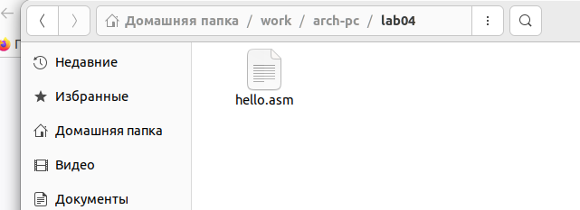
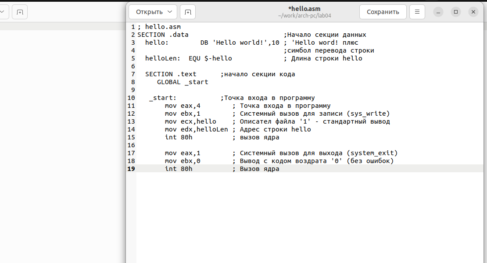
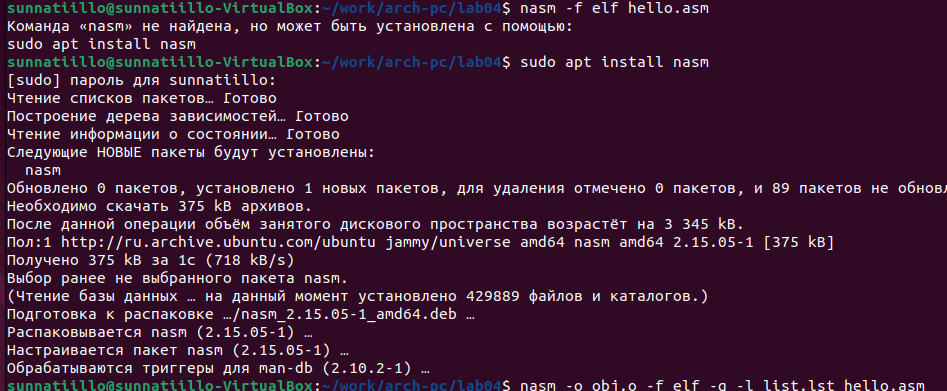
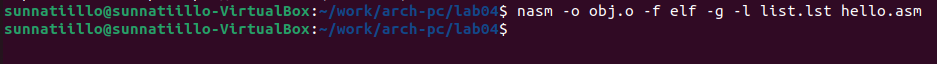
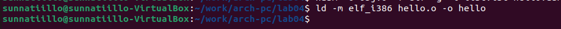
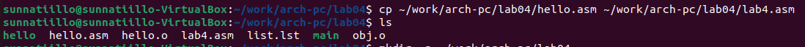
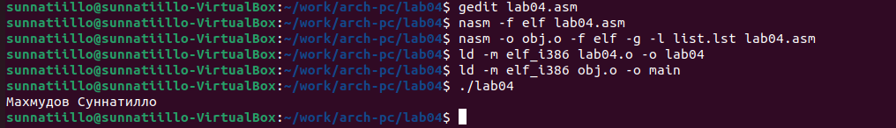

---
## Front matter
title: "Oтчёта по лабораторной работе #4"
subtitle: "Простейший вариант"
author: "Махмудов Суннатилло Баходиривич"

## Generic otions
lang: ru-RU
toc-title: "Содержание"

## Bibliography
bibliography: bib/cite.bib
csl: pandoc/csl/gost-r-7-0-5-2008-numeric.csl

## Pdf output format
toc: true # Table of contents
toc-depth: 2
lof: true # List of figures
lot: true # List of tables
fontsize: 12pt
linestretch: 1.5
papersize: a4
documentclass: scrreprt
## I18n polyglossia
polyglossia-lang:
  name: russian
  options:
	- spelling=modern
	- babelshorthands=true
polyglossia-otherlangs:
  name: english
## I18n babel
babel-lang: russian
babel-otherlangs: english
## Fonts
mainfont: PT Serif
romanfont: PT Serif
sansfont: PT Sans
monofont: PT Mono
mainfontoptions: Ligatures=TeX
romanfontoptions: Ligatures=TeX
sansfontoptions: Ligatures=TeX,Scale=MatchLowercase
monofontoptions: Scale=MatchLowercase,Scale=0.9
## Biblatex
biblatex: true
biblio-style: "gost-numeric"
biblatexoptions:
  - parentracker=true
  - backend=biber
  - hyperref=auto
  - language=auto
  - autolang=other*
  - citestyle=gost-numeric
## Pandoc-crossref LaTeX customization
figureTitle: "Рис."
tableTitle: "Таблица"
listingTitle: "Листинг"
lofTitle: "Список иллюстраций"
lotTitle: "Список таблиц"
lolTitle: "Листинги"
## Misc options
indent: true
header-includes:
  - \usepackage{indentfirst}
  - \usepackage{float} # keep figures where there are in the text
  - \floatplacement{figure}{H} # keep figures where there are in the text
---

# Цель работы

Освоение процедуры компиляции и сборки программ, написанных на ассемблере NASM.

# Задание

# Теоретическое введение
 
Основными функциональными элементами любой электронно-вычислительной машины
(ЭВМ) являются центральный процессор, память и периферийные устройства (рис. 4.1).
Взаимодействие этих устройств осуществляется через общую шину, к которой они подклю-
чены. Физически шина представляет собой большое количество проводников, соединяющих
устройства друг с другом. В современных компьютерах проводники выполнены в виде элек-
тропроводящих дорожек на материнской (системной) плате.
Основной задачей процессора является обработка информации, а также организация
координации всех узлов компьютера. В состав центрального процессора (ЦП) входят
следующие устройства:

# Выполнение лабораторной работы

 2.1 Задание №1.
Открил терминал. (рис. @fig:001).

{#fig:001 width=70%}

2.2 Задание №2.
Создайте каталог для работы с программами на языке ассемблера NASM:(рис. @fig:002).
 
 
{#fig:002 width=70%}

2.3 Задание №3.
Перейдите в созданный каталог (рис. @fig:003).

{#fig:003 width=70%}

2.4 Задание №4.
Создайте текстьовый файл с именем hello.asm (рис. @fig:004).

{#fig:004 width=70%}

2.5 Задание №5.
Откройте файл с помощью любого текстового редактора,например,gedit (рис. @fig:006).

{#fig:006 width=70%}

2.6 Задание №6.
Введите в  Hello.asm следующий текст; (рис. @fig:005).

{#fig:005 width=70%} 

(рис. @fig:007).

{#fig:007 width=70%} 

2.7 Задание №7.
Транслятор NASM
NASM превращает текст программы в обьектный код (рис. @fig:008).

{#fig:008 width=70%}

2.8 Задание №8.
Расширенный синтаксис командной строки NASM.
Выполните следующую команду (рис. @fig:009).

{#fig:009 width=70%}

2.9 Задание №9.
Компоновщик LD
Чтобы получить исполняемую программу, объектный файл
необходимо передать на обработку компоновщику: (рис. @fig:0011).

{#fig:0011 width=70%}

2.10 Задание №10.
Формат командной строки LD можно увидеть, набрав ld --help. Для получения более
подробной информации см. man ld (рис. @fig:0012).

{#fig:0012 width=70%}

2.11 Задание №11.
Запуск исполняемого файла
Запустить на выполнение созданный исполняемый файл, находящийся в текущем каталоге,
можно, набрав в командной строке: (рис. @fig:0013).

{#fig:0013 width=70%}

#3 Задание для самостоятельной работы

3.1 В каталоге ~/work/arch-pc/lab04 с помощью команды cp создайте копию файла
hello.asm с именем lab4.asm (рис. @fig:0014).

{#fig:0014 width=70%}

3.2 С помощью любого текстового редактора внесите изменения в текст программы в
файле lab4.asm так, чтобы вместо Hello world! на экран выводилась строка с вашими
фамилией и именем.(рис. @fig:0015).

{#fig:0015 width=70%}

# Выводы

Результатом данной лабораторной работы, является используя Ассемблера– удобный язык разметки.

