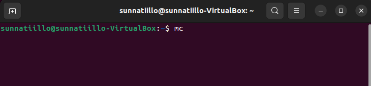
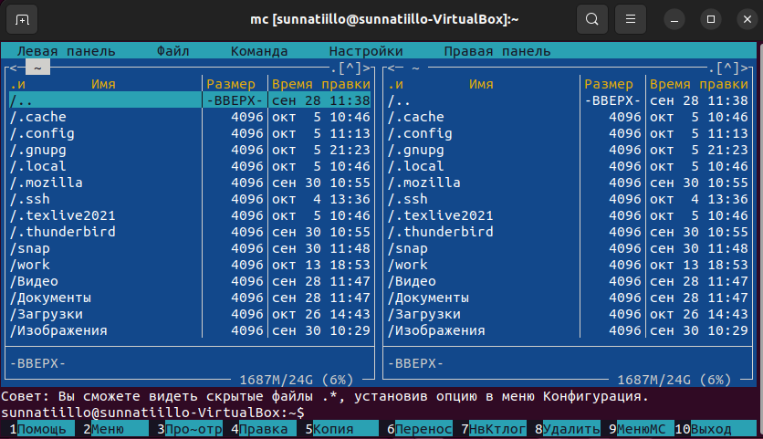
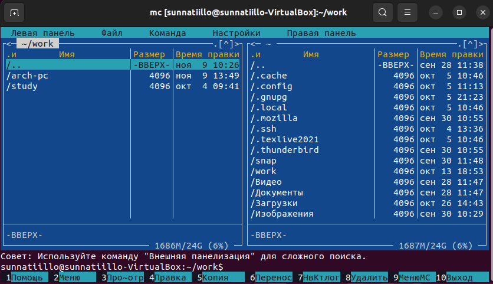
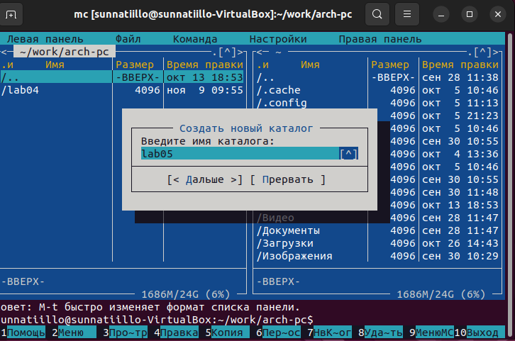
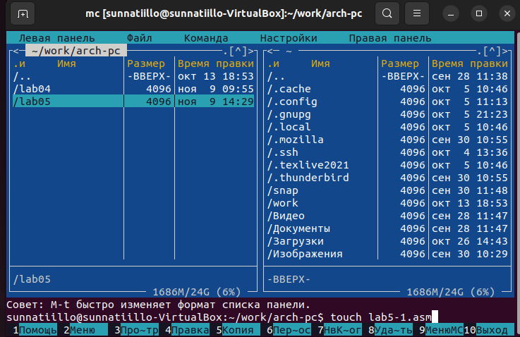
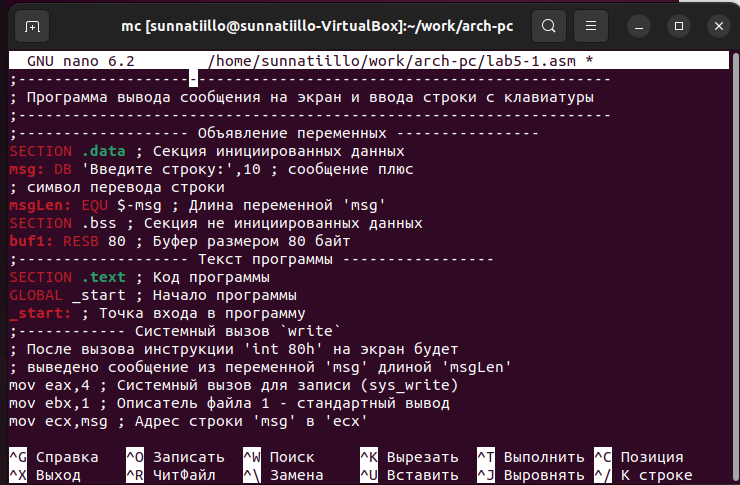
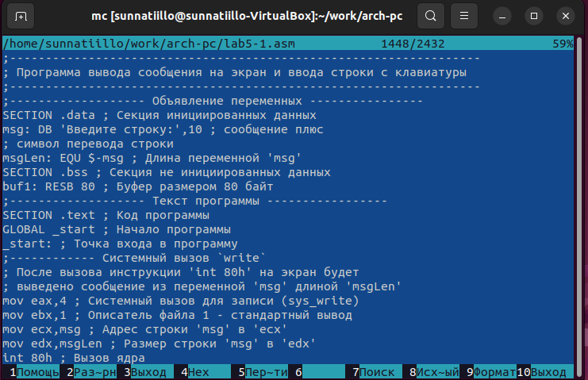
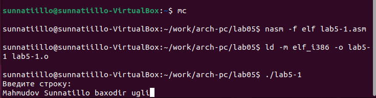
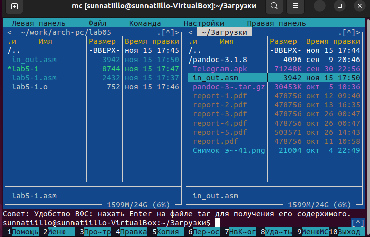
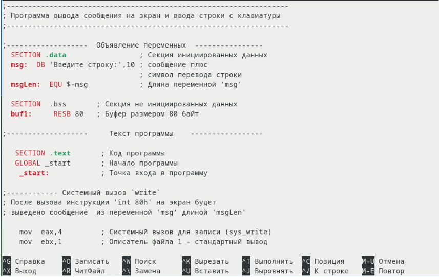

---
## Front matter
title: "Отчёта по лабораторной работе 5"
subtitle: "Простейший вариант"
author: "Махмудов Суннатилло Баходир угли"

## Generic otions
lang: ru-RU
toc-title: "Содержание"

## Bibliography
bibliography: bib/cite.bib
csl: pandoc/csl/gost-r-7-0-5-2008-numeric.csl

## Pdf output format
toc: true # Table of contents
toc-depth: 2
lof: true # List of figures
lot: true # List of tables
fontsize: 12pt
linestretch: 1.5
papersize: a4
documentclass: scrreprt
## I18n polyglossia
polyglossia-lang:
  name: russian
  options:
	- spelling=modern
	- babelshorthands=true
polyglossia-otherlangs:
  name: english
## I18n babel
babel-lang: russian
babel-otherlangs: english
## Fonts
mainfont: PT Serif
romanfont: PT Serif
sansfont: PT Sans
monofont: PT Mono
mainfontoptions: Ligatures=TeX
romanfontoptions: Ligatures=TeX
sansfontoptions: Ligatures=TeX,Scale=MatchLowercase
monofontoptions: Scale=MatchLowercase,Scale=0.9
## Biblatex
biblatex: true
biblio-style: "gost-numeric"
biblatexoptions:
  - parentracker=true
  - backend=biber
  - hyperref=auto
  - language=auto
  - autolang=other*
  - citestyle=gost-numeric
## Pandoc-crossref LaTeX customization
figureTitle: "Рис."
tableTitle: "Таблица"
listingTitle: "Листинг"
lofTitle: "Список иллюстраций"
lotTitle: "Список таблиц"
lolTitle: "Листинги"
## Misc options
indent: true
header-includes:
  - \usepackage{indentfirst}
  - \usepackage{float} # keep figures where there are in the text
  - \floatplacement{figure}{H} # keep figures where there are in the text
---

# Цель работы

Приобретение практических навыков работы в Midnight Commander. Освоение инструкций
языка ассемблера mov и int

# Задание

# Теоретическое введение

Midnight Commander (или просто mc) — это программа, которая позволяет просматривать
структуру каталогов и выполнять основные операции по управлению файловой системой,
т.е. mc является файловым менеджером. Midnight Commander позволяет сделать работу с
файлами более удобной и наглядной

# Выполнение лабораторной работы

Откройте Midnight Commander (рис. @fig:001).

{#fig:001 width=70%}

Перейдите в каталог ~/work/arch-pc созданный
при выполнении лабораторной работы №4 (рис. @fig:002).

{#fig:002 width=70%}

{#fig:003 width=70%}

С помощью функциональной клавиши F7 создайте папку lab05 и перейдите
в созданный каталог.(рис. @fig:004).

{#fig:004 width=70%}

Пользуясь строкой ввода и командой touch создайте файл lab5-1.asm (рис. @fig:005).

{#fig:005 width=70%}

С помощью функциональной клавиши F4 откройте файл lab5-1.asm для редактирова-
ния во встроенном редакторе. Как правило в качестве встроенного редактора Midnight
Commander используется редакторы nano (рис. @fig:006).

{#fig:006 width=70%}

Введите текст программы из листинга  (можно без комментариев), сохраните изме-
нения и закройте файл.(рис. @fig:007).

{#fig:007 width=70%}

С помощью функциональной клавиши F3 откройте файл lab5-1.asm для просмотра.
Убедитесь, что файл содержит текст программы (рис. @fig:007).

{#fig:007 width=70%}

Оттранслируйте текст программы lab5-1.asm в объектный файл. Выполните компо-
новку объектного файла и запустите получившийся исполняемый файл. Программа
выводит строку 'Введите строку:' и ожидает ввода с клавиатуры. На запрос введите
Ваши ФИО (рис. @fig:008).

{#fig:008 width=70%}

Скачайте файл in_out.asm со страницы курса в ТУИС. (рис. @fig:009).

{#fig:009 width=70%}

Подключаемый файл in_out.asm должен лежать в том же каталоге, что и файл с про-
граммой, в которой он используется.(рис. @fig:0010).

{#fig:0010 width=70%}

# Выводы

Практические навыки в Midnight Commander
