---
## Front matter
title: "Отчёта по лабораторной работе №6"
subtitle: "НПИоб-03-23"
author: "Махмудов Суннатилло Баходир угли"

## Generic otions
lang: ru-RU
toc-title: "Содержание"

## Bibliography
bibliography: bib/cite.bib
csl: pandoc/csl/gost-r-7-0-5-2008-numeric.csl

## Pdf output format
toc: true # Table of contents
toc-depth: 2
lof: true # List of figures
lot: true # List of tables
fontsize: 12pt
linestretch: 1.5
papersize: a4
documentclass: scrreprt
## I18n polyglossia
polyglossia-lang:
  name: russian
  options:
	- spelling=modern
	- babelshorthands=true
polyglossia-otherlangs:
  name: english
## I18n babel
babel-lang: russian
babel-otherlangs: english
## Fonts
mainfont: PT Serif
romanfont: PT Serif
sansfont: PT Sans
monofont: PT Mono
mainfontoptions: Ligatures=TeX
romanfontoptions: Ligatures=TeX
sansfontoptions: Ligatures=TeX,Scale=MatchLowercase
monofontoptions: Scale=MatchLowercase,Scale=0.9
## Biblatex
biblatex: true
biblio-style: "gost-numeric"
biblatexoptions:
  - parentracker=true
  - backend=biber
  - hyperref=auto
  - language=auto
  - autolang=other*
  - citestyle=gost-numeric
## Pandoc-crossref LaTeX customization
figureTitle: "Рис."
tableTitle: "Таблица"
listingTitle: "Листинг"
lofTitle: "Список иллюстраций"
lotTitle: "Список таблиц"
lolTitle: "Листинги"
## Misc options
indent: true
header-includes:
  - \usepackage{indentfirst}
  - \usepackage{float} # keep figures where there are in the text
  - \floatplacement{figure}{H} # keep figures where there are in the text
---

# Цель работы

Цель данного шаблона --- максимально упростить подготовку отчётов по
лабораторным работам.  Модифицируя данный шаблон, студенты смогут без
труда подготовить отчёт по лабораторным работам, а также познакомиться
с основными возможностями разметки Markdown.

# Задание

1. Символьные и численные данные в NASM

2. Выполнение арифметических операций в NASM

3. Выполнение заданий для самостоятельной работы

# Теоретическое введение

 Большинство инструкций на языке ассемблера требуют обработки операндов. Адрес опе-
ранда предоставляет место, где хранятся данные, подлежащие обработке. Это могут быть
данные хранящиеся в регистре или в ячейке памяти. Далее рассмотрены все существующие
способы задания адреса хранения операндов – способы адресации. 
    
    
    
# Выполнение лабораторной работы
 
 
#Символьные и численные данные в NASM

Создаю каталог для программ лабораторной работы № 6, перейду в него и
создаю файл lab6-1.asm:(рис. @fig:001).

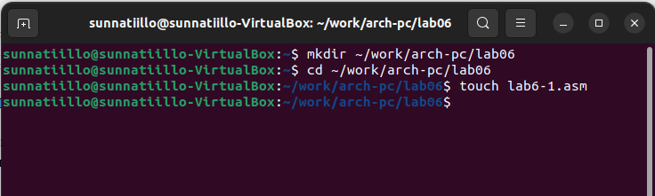{#fig:001 width=70%}

Рассмотрим примеры программ вывода символьных и численных значений. Програм-
мы будут выводить значения записанные в регистр eax. (рис. @fig:002).

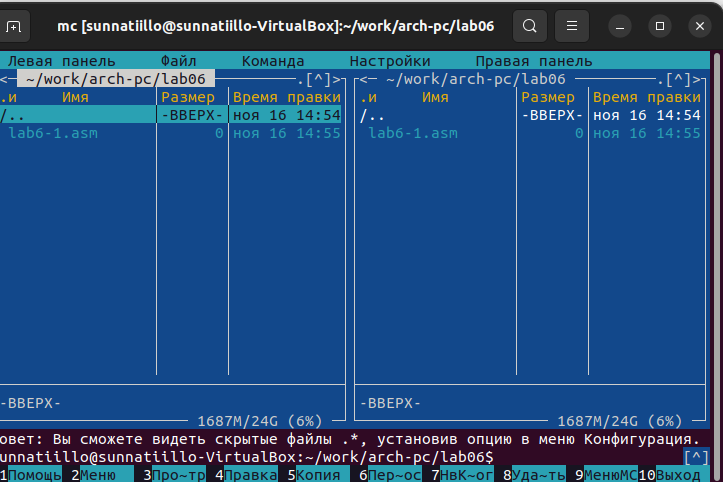{#fig:002 width=70%}

Введу в файл lab6-1.asm текст программы из листинга 6.1.(рис. @fig:003).

 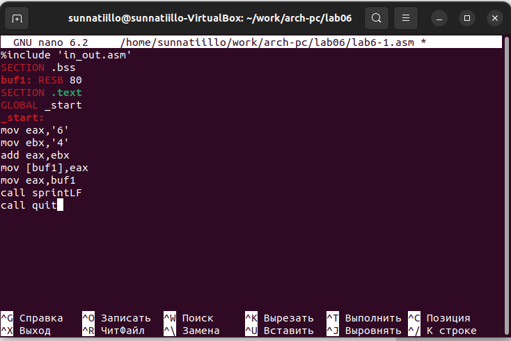{#fig:003 width=70%}
 
 
 
 
 
 Создаю исполняемый файл и запускаю его.(рис. @fig:004).

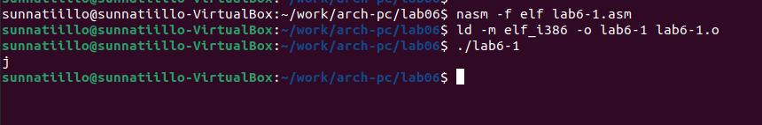{#fig:004 width=70%}

Далее изменяю текст программы и вместо символов, запишу в регистры числа. Ис-
правляю текст программы (Листинг 6.1) следующим образом: заменяю строки (рис. @fig:005).

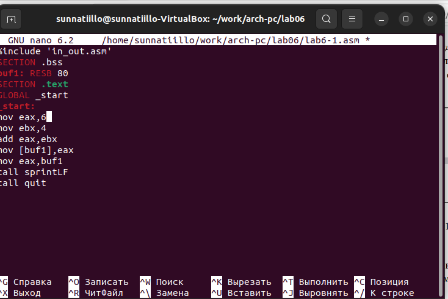{#fig:005 width=70%}

Создаю исполняю файл и запускаю его (рис. @fig:006).

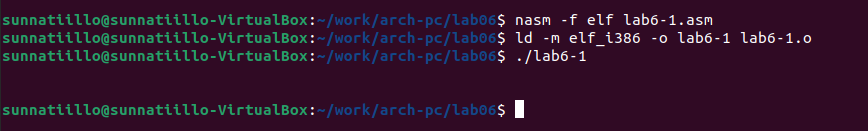{#fig:001 width=70%}

Создаю файл lab6-2.asm в каталоге ~/work/arch-pc/lab06 и ввожу в него текст про-
граммы из листинга 6.2.(рис. @fig:007).

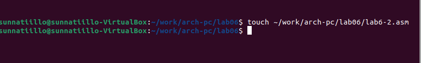{#fig:007 width=70%}

Создаю исполняемый файл и запускаю его.(рис. @fig:008).

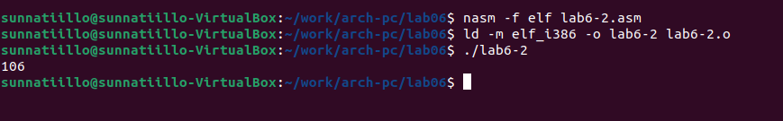{#fig:008 width=70%}

Аналогично предыдущему примеру изменяю символы на числа. Заменяю строки (рис. @fig:009).

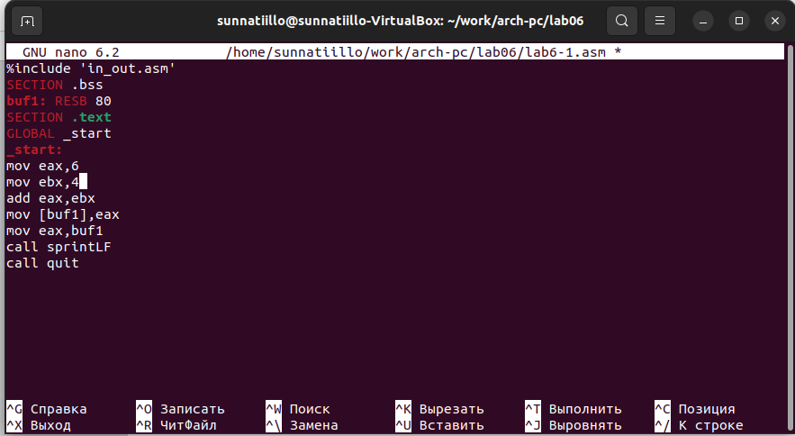{#fig:009 width=70%}

Создаю исполняемый файл и запускаю его. Какой результат будет получен при исполне-
нии программы?(рис. @fig:0010).

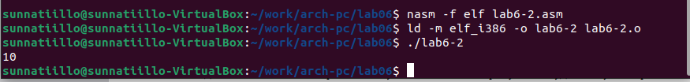{#fig:0010 width=70%}

Заменяю в тексте программы функцию iprintLF на iprint (рис. @fig:0011).

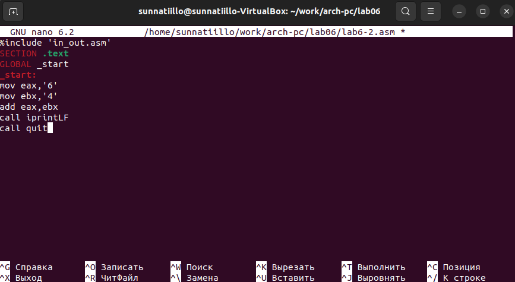{#fig:0011 width=70%}

Создаю и запускаю новый исполняемый файл (рис. @fig:0012).

Вывод изменился,потому что симбол переноса строки отображался когда программа исполнялась с функцией iprintLF,а iprint добавляет к выводу симбол переноса строку в отличие от iprintLF.

{#fig:001 width=70%}

#Выполнение арифметических операций в NASM

Создаю файл lab6-3.asm в каталоге ~/work/arch-pc/lab06:(рис. @fig:0013).

{#fig:0013 width=70%}

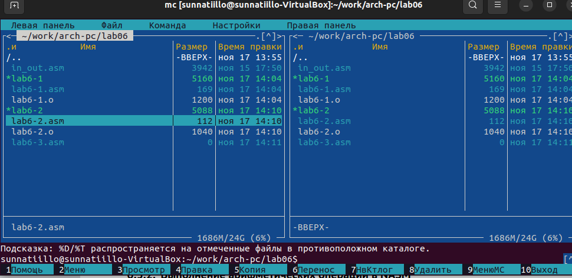{#fig:0014 width=70%}

из листинга 6.3 и введите в lab6-3.asm.(рис. @fig:001).

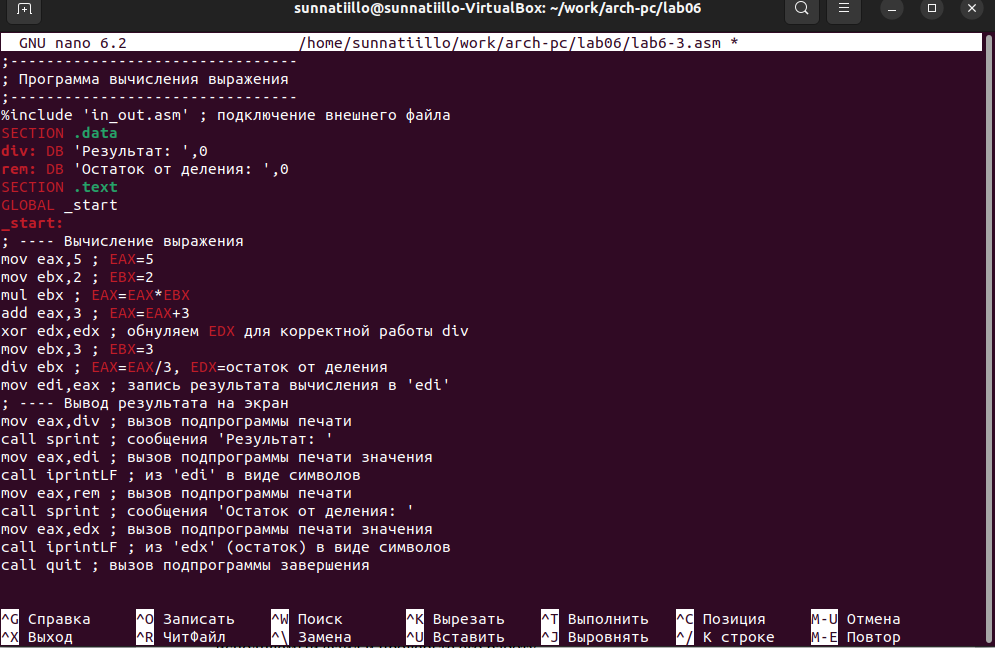{#fig:001 width=70%}

Листинг 6.3. Программа вычисления выражения

Создаю исполняемый файл и запускаю его. Результат работы программы должен быть
следующим:(рис. @fig:001).

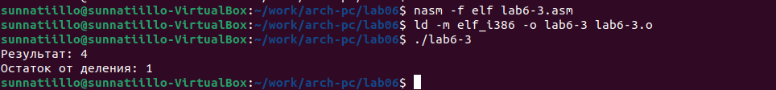{#fig:001 width=70%}

Изменяю текст программы для вычисления выражения 𝑓(𝑥) = (4 ∗ 6 + 2)/5. .(рис. @fig:001)

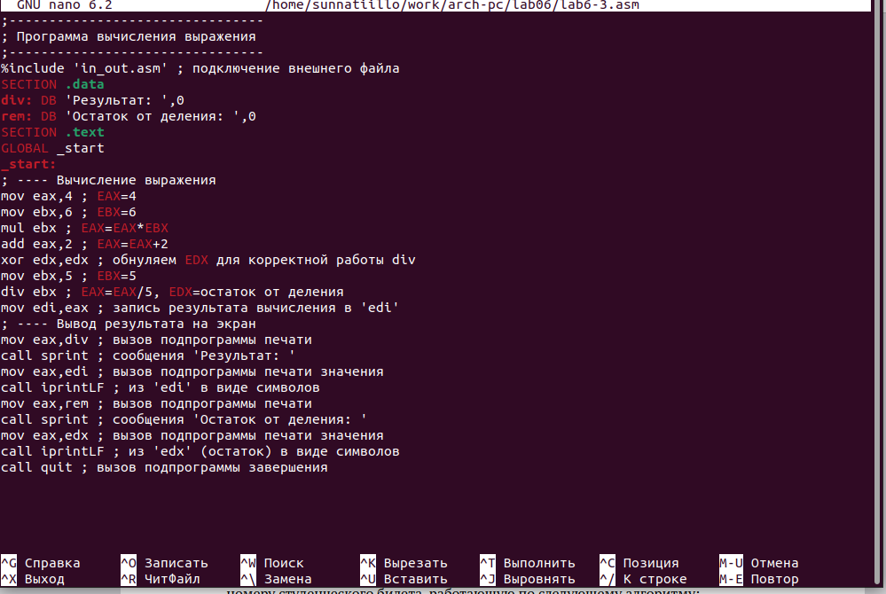{#fig:001 width=70%}

Создаю исполняемый файл и проверяю его работу (рис. @fig:001)

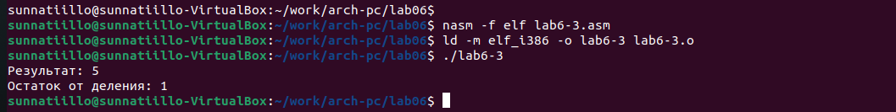{#fig:001 width=70%}

Создаю файл variant.asm в каталоге ~/work/arch-pc/lab06:(рис. @fig:001)
Листинг 6.4. Программа вычисления вычисления варианта задания по номеру
студенческого билета

{#fig:001 width=70%}

Листинг 6.4. Программа  вычисления варианта задания по номеру
студенческого билета .(рис. @fig:001)
При выполнении данной лабораторной работы я освоил арифметические инструкции языка ассемблера NASM

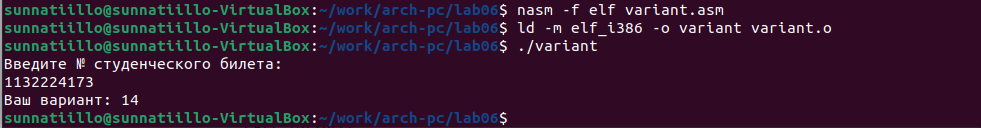{#fig:001 width=70%}

#Ответы на вопросы по программе

1. За вывод сообщения "Ваш вариант" отвечают строки кода:

mov eax.rem

call sprint

2. Инструкция mov еск, к используется, чтобы положить адрес вводимой стро ких в регистр есx mov edx, 80 запись в регистр ейх длины вводимой строки call sread вызов подпрограммы из внешнего файла, обеспечивающей ввод сообщения с клавиатуры 2022-252

3. call atol используется для вызова подпрограммы из внешнего файла, кото рая преобразует всії-код символа в целое число и записывает результат в регистр сах

4. За вычисления варианта отвечают строки:

ко ехех обнуление ех для корректной работы там «ок.20 сок - 20 div тах/20, dx остаток от деления ine edx edx estx 1

5. При выполнении инструкции div ebx остаток от деления записывается регистр ех

6. Инструкция ine edx увеличивает значение регистра eх на 1

7. За вывод на экран результатов вычислений отвечают строки:

 nov eax, 
 
 eds call iprintLF

#Задание для самостоятельной работы

Написать программу вычисления выражения 𝑦 = 𝑓(𝑥). Программа должна выводить
выражение для вычисления, выводить запрос на ввод значения 𝑥, вычислять задан-
ное выражение в зависимости от введенного 𝑥, выводить результат вычислений. Вид
функции 𝑓(𝑥) выбрать из таблицы 6.3 вариантов заданий в соответствии с номером
полученным при выполнении лабораторной работы. Создайте исполняемый файл и
проверьте его работу для значений 𝑥1 и 𝑥2 из 6.3.(рис. @fig:001)

{#fig:001 width=70%}

Winclude ' as * m' ; подключение внешнего файла

SECTION data; секция инициированных данных

msg: DB 'Введите значение переменной х:,0

rem: DB 'Результат: ',0

SECTION bss; секция не инициированных данных

х: RЕЅB 80 ; Переменная, значение к-рой будем вводить с клавиатуры, выделенный ре

SECTION text; Код программы

GLOBAL _start; Начало программы

_start: Точка входа в программу

Вычисление выражения

mov eax, ns; запись адреса выводимного сообщения в сах

call sprint; вызов подпрограммы печати сообщения

mov есх, х; запись адреса переменной в есх mov edx, 80; запись длины вводимого значения в

call sread; вызов подпрограммы ввода сообщения

mov eax,x ; вызов подпрограммы преобразования

call atoi; ASCII кода в число, сахих

add eax,11; eax = eax + 11 = x + 11

mov ebx,2; запись значения 2 в регистр сх

mul ebx; EAX=EAX^ * EBX = (x + 11) + 2

add eax,-6;

eax = eax - 6 = (x + 11) * 2 * 6

mov edi, eax; запись результата вычисления в 'edi'

Вывод результата на экран

mov eax,rem, вызов подпрограммы печати

call sprint: сообщения Результат:

mov eax, edi ; вызов подпрограммы печати значения call iprint; из 'edi в виде символов

call quit, вызов подпрограммы завершения

# Выводы

При выполнении данной лабораторной работы я освоил арифметические инструкции языка ассемблера NASM

