---
## Front matter
title: "Отчёта по лабораторной работе #8"
subtitle: "НПИ-03-23"
author: "Махмудов Суннатилло Баходир угли"

## Generic otions
lang: ru-RU
toc-title: "Содержание"

## Bibliography
bibliography: bib/cite.bib
csl: pandoc/csl/gost-r-7-0-5-2008-numeric.csl

## Pdf output format
toc: true # Table of contents
toc-depth: 2
lof: true # List of figures
lot: true # List of tables
fontsize: 12pt
linestretch: 1.5
papersize: a4
documentclass: scrreprt
## I18n polyglossia
polyglossia-lang:
  name: russian
  options:
	- spelling=modern
	- babelshorthands=true
polyglossia-otherlangs:
  name: english
## I18n babel
babel-lang: russian
babel-otherlangs: english
## Fonts
mainfont: PT Serif
romanfont: PT Serif
sansfont: PT Sans
monofont: PT Mono
mainfontoptions: Ligatures=TeX
romanfontoptions: Ligatures=TeX
sansfontoptions: Ligatures=TeX,Scale=MatchLowercase
monofontoptions: Scale=MatchLowercase,Scale=0.9
## Biblatex
biblatex: true
biblio-style: "gost-numeric"
biblatexoptions:
  - parentracker=true
  - backend=biber
  - hyperref=auto
  - language=auto
  - autolang=other*
  - citestyle=gost-numeric
## Pandoc-crossref LaTeX customization
figureTitle: "Рис."
tableTitle: "Таблица"
listingTitle: "Листинг"
lofTitle: "Список иллюстраций"
lotTitle: "Список таблиц"
lolTitle: "Листинги"
## Misc options
indent: true
header-includes:
  - \usepackage{indentfirst}
  - \usepackage{float} # keep figures where there are in the text
  - \floatplacement{figure}{H} # keep figures where there are in the text
---

# Цель работы

Приобретение навыков написания программ с использованием циклов и обработкой
аргументов командной строки.

# Задание

Реализация циклов в NASM

Обработка аргументов командной строки

Задание для самостоятельной работы

# Теоретическое введение

Стек — это структура данных, организованная по принципу LIFO («Last In — First Out»
или «последним пришёл — первым ушёл»). Стек является частью архитектуры процессора и
реализован на аппаратном уровне. Для работы со стеком в процессоре есть специальные
регистры (ss, bp, sp) и команды.
Основной функцией стека является функция сохранения адресов возврата и передачи
аргументов при вызове процедур. Кроме того, в нём выделяется память для локальных
переменных и могут временно храниться значения регистров.
На рис. 8.1 показана схема организации стека в процессоре.
Стек имеет вершину, адрес последнего добавленного элемента, который хранится в ре-
гистре esp (указатель стека). Противоположный конец стека называется дном. Значение,
помещённое в стек последним, извлекается первым. При помещении значения в стек указа-
тель стека уменьшается, а при извлечении — увеличивается.
Для стека существует две основные операции:
• добавление элемента в вершину стека (push);
• извлечение элемента из вершины стека (pop).

# Выполнение лабораторной работы

Реализация циклов в NASM

Создал каталог для программам лабораторной работы № 8, перешел в него и создал
файл lab8-1.asm: (рис. @fig:001).

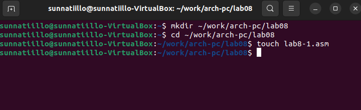{#fig:001 width=70%}

Ввел в файл lab8-1.asm текст программы из листинга 8.1.(рис. @fig:001).

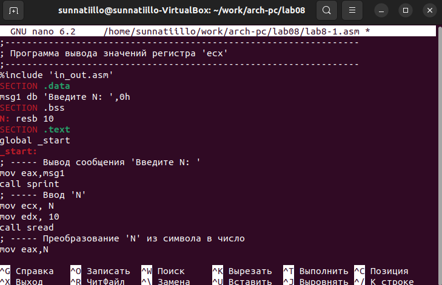{#fig:001 width=70%}

Исполняемый файли проверял его работу.(рис. @fig:001).

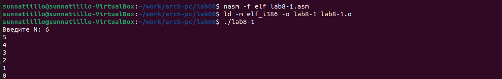{#fig:001 width=70%}

Данный пример показывает, что использование регистра ecx в теле цилка loop может
привести к некорректной работе программы.

Изменил текст программы добавил изменение значение регистра ecx в цикле(рис. @fig:001).

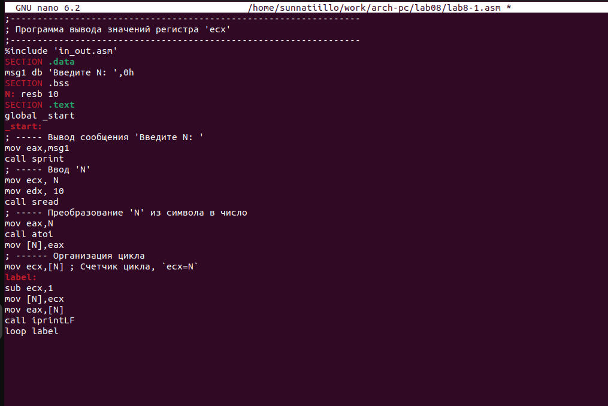{#fig:001 width=70%}

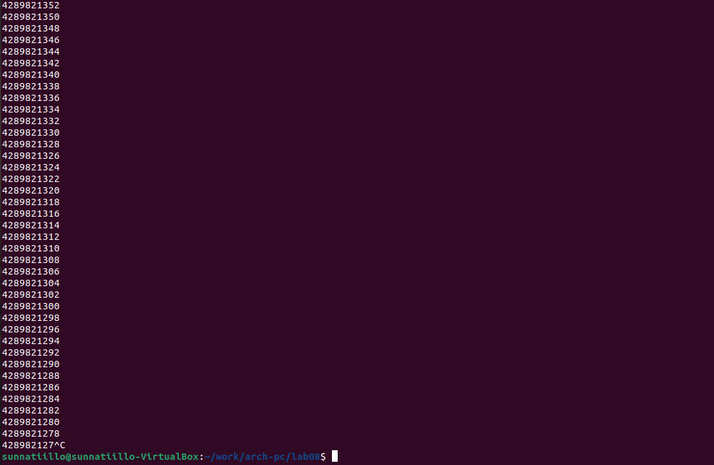{#fig:001 width=70%}

Для использования регистра ecx в цикле и сохранения корректности работы программы
можно использовать стек. В изменения в текст программы добавив команды push
и pop для сохранения значения счетчика цикла
loop:

Опять изменил текст программы (рис. @fig:001).

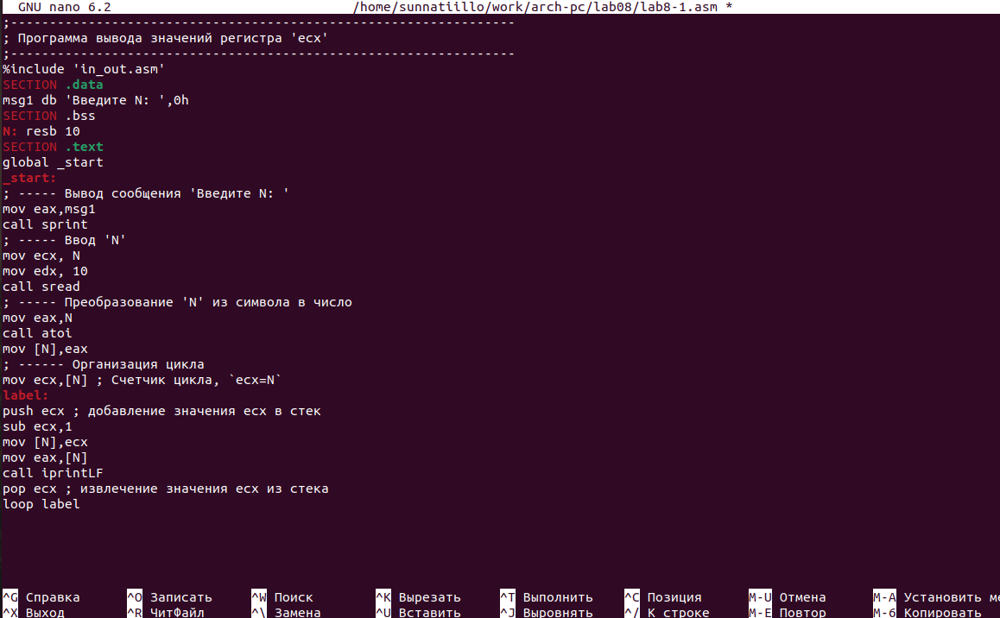{#fig:001 width=70%}

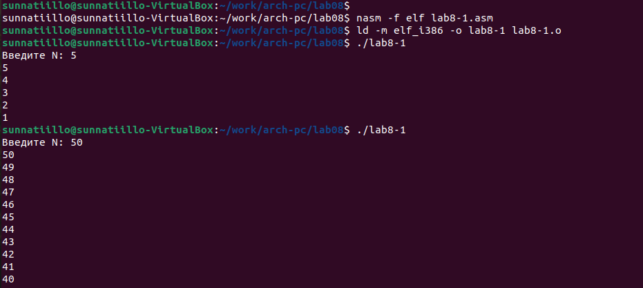{#fig:001 width=70%}

Обработка аргументов командной строки

При запуске программы в NASM аргументы командной строки загружаются в стек в обрат-
ном порядке, кроме того в стек записывается имя программы и общее количество аргументов.
Последние два элемента стека для программы, скомпилированной NASM, – это всегда имя
программы и количество переданных аргументов.

Создал файл lab8-2.asm (рис. @fig:001).

{#fig:001 width=70%}

Ввел в него текст программы из листинга 8.2.(рис. @fig:001).

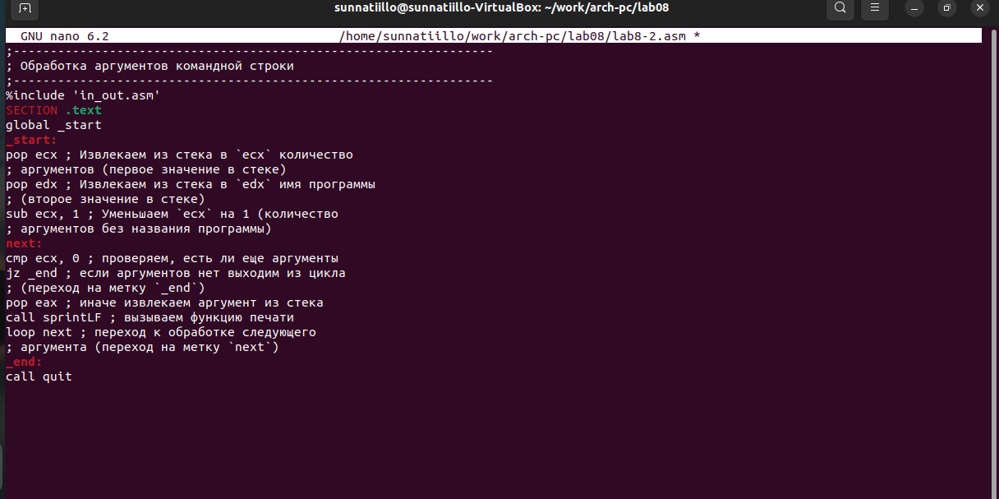{#fig:001 width=70%}

На исполняемый файл запустил указав аргументы:(рис. @fig:001).

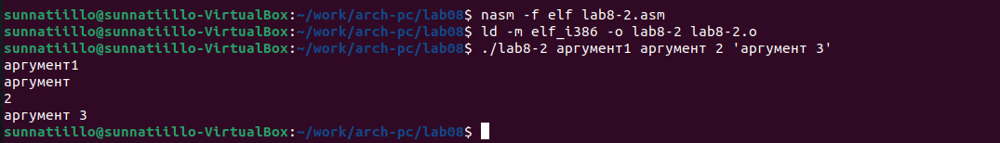{#fig:001 width=70%}

Рассмотрим еще один пример программы которая выводит сумму чисел, которые пере-
даются в программу как аргументы.

Создал файл lab8-3.asm (рис. @fig:001).

{#fig:001 width=70%}

Ввел на файл lab8-3.asm текст программы из листинга 8.3.(рис. @fig:001).

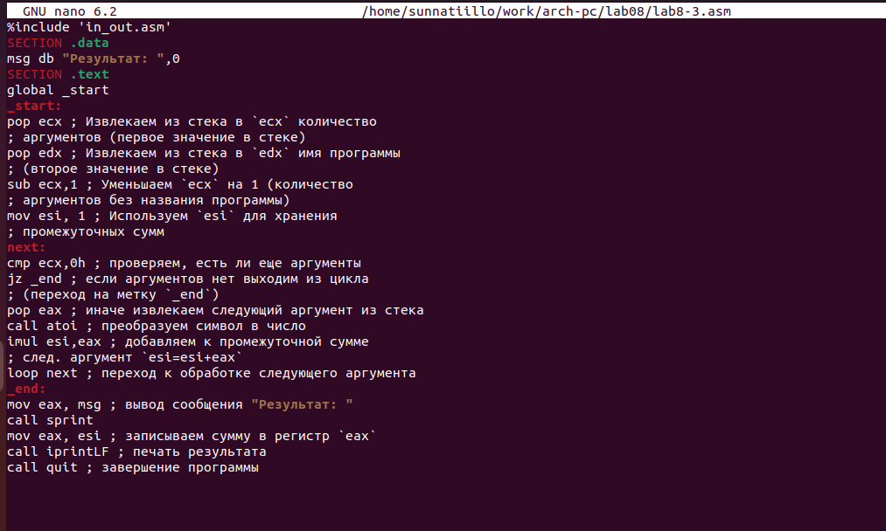{#fig:001 width=70%}

Создал исполняемый файл и запустите его, указав аргументы.(рис. @fig:001).

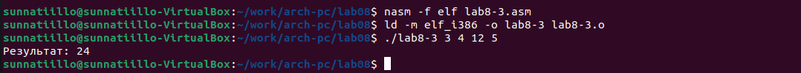{#fig:001 width=70%}

Изменил текст программы из листинга 8.3 для вычисления произведения аргументов
командной строки.(рис. @fig:001).

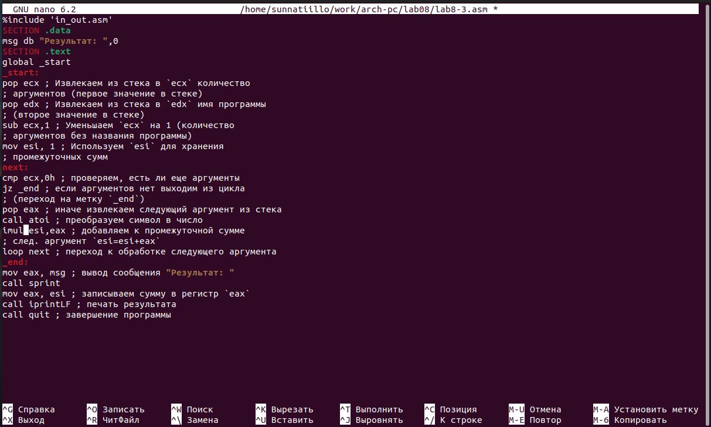{#fig:001 width=70%}

Проверял его работу (рис. @fig:001).

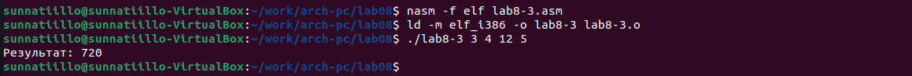{#fig:001 width=70%}

# Задание для самостоятельной работы

Вариант 14:

Я создал файл lab8-4.asm чтобы сделать свою вариант :(рис. @fig:001).

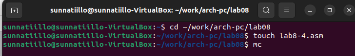{#fig:001 width=70%}

Ввел на файл lab8-4.asm текст из листинга 8.3 и поменял (рис. @fig:001).

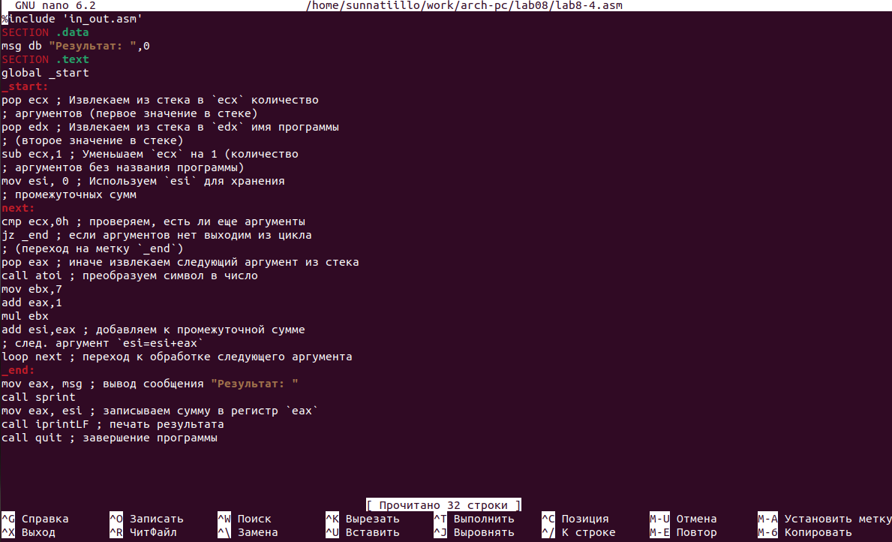{#fig:001 width=70%}

Проверял его работу (рис. @fig:001).

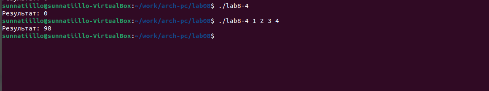{#fig:001 width=70%}

# Выводы

Я научился писать программы с использованием циклов и обрабатывать аргументы командной строки.

# Список литературы{.unnumbered}

1. GDB: The GNU Project Debugger. — URL: https://www.gnu.org/software/gdb/.
2. GNU Bash Manual. — 2016. — URL: https://www.gnu.org/software/bash/manual/.
3. Midnight Commander Development Center. — 2021. — URL: https://midnight-commander.
org/.
4. NASM Assembly Language Tutorials. — 2021. — URL: https://asmtutor.com/.
5. Newham C. Learning the bash Shell: Unix Shell Programming. — O’Reilly Media, 2005. —
354 с. — (In a Nutshell). — ISBN 0596009658. — URL: http://www.amazon.com/Learning-
bash-Shell-Programming-Nutshell/dp/0596009658.
6. Robbins A. Bash Pocket Reference. — O’Reilly Media, 2016. — 156 с. — ISBN 978-1491941591.
7. The NASM documentation. — 2021. — URL: https://www.nasm.us/docs.php.
8. Zarrelli G. Mastering Bash. — Packt Publishing, 2017. — 502 с. — ISBN 9781784396879.
9. Колдаев В. Д., Лупин С. А. Архитектура ЭВМ. — М. : Форум, 2018.
10. Куляс О. Л., Никитин К. А. Курс программирования на ASSEMBLER. — М. : Солон-Пресс,
2017.
11. Новожилов О. П. Архитектура ЭВМ и систем. — М. : Юрайт, 2016.
12. Расширенный ассемблер: NASM. — 2021. — URL: https://www.opennet.ru/docs/RUS/nasm/.
13. Робачевский А., Немнюгин С., Стесик О. Операционная система UNIX. — 2-е изд. — БХВ-
Петербург, 2010. — 656 с. — ISBN 978-5-94157-538-1.
14. Столяров А. Программирование на языке ассемблера NASM для ОС Unix. — 2-е изд. —
М. : МАКС Пресс, 2011. — URL: http://www.stolyarov.info/books/asm_unix.
15. Таненбаум Э. Архитектура компьютера. — 6-е изд. — СПб. : Питер, 2013. — 874 с. —
(Классика Computer Science).
16. Таненбаум Э., Бос Х. Современные операционные системы. — 4-е изд. — СПб. : Питер,
2015. — 1120 с. — (Классика Computer Science).

