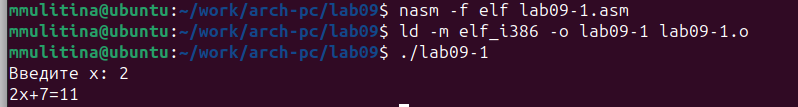
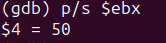
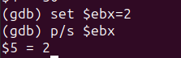

---
## Front matter
title: "Отчёта по лабораторной работе №9"
subtitle: "НПИ-03-23"
author: "Махмудов Суннатилло Баходир угли"

## Generic otions
lang: ru-RU
toc-title: "Содержание"

## Bibliography
bibliography: bib/cite.bib
csl: pandoc/csl/gost-r-7-0-5-2008-numeric.csl

## Pdf output format
toc: true # Table of contents
toc-depth: 2
lof: true # List of figures
lot: true # List of tables
fontsize: 12pt
linestretch: 1.5
papersize: a4
documentclass: scrreprt
## I18n polyglossia
polyglossia-lang:
  name: russian
  options:
	- spelling=modern
	- babelshorthands=true
polyglossia-otherlangs:
  name: english
## I18n babel
babel-lang: russian
babel-otherlangs: english
## Fonts
mainfont: PT Serif
romanfont: PT Serif
sansfont: PT Sans
monofont: PT Mono
mainfontoptions: Ligatures=TeX
romanfontoptions: Ligatures=TeX
sansfontoptions: Ligatures=TeX,Scale=MatchLowercase
monofontoptions: Scale=MatchLowercase,Scale=0.9
## Biblatex
biblatex: true
biblio-style: "gost-numeric"
biblatexoptions:
  - parentracker=true
  - backend=biber
  - hyperref=auto
  - language=auto
  - autolang=other*
  - citestyle=gost-numeric
## Pandoc-crossref LaTeX customization
figureTitle: "Рис."
tableTitle: "Таблица"
listingTitle: "Листинг"
lofTitle: "Список иллюстраций"
lotTitle: "Список таблиц"
lolTitle: "Листинги"
## Misc options
indent: true
header-includes:
  - \usepackage{indentfirst}
  - \usepackage{float} # keep figures where there are in the text
  - \floatplacement{figure}{H} # keep figures where there are in the text
---

# Цель работы

Приобретение навыков написания программ с использованием подпрограмм.
Знакомство с методами отладки при помощи GDB и его основными возможностями.

# Задание

1. Реализация подпрограмм в NASM.

2. Отладка программ с помощью GDB.

4. Работа с данными программы в GDB.

5. Обработка аргументов командной строки в GDB.

6. Преобразование программы из лабораторной работы №8, реализовав

вычисление значения функции как подпрограмму.

7. Проверить неправильную работу программы, проанализировав изменения

значения регистров. Определить ошибку и исправить ее

# Теоретическое введение

Отладка — это процесс поиска и исправления ошибок в программе. В общем случае
его можно разделить на четыре этапа:
• обнаружение ошибки;
• поиск её местонахождения;
• определение причины ошибки;
• исправление ошибки.
Можно выделить следующие типы ошибок:
• синтаксические ошибки — обнаруживаются во время трансляции исходного кода и
вызваны нарушением ожидаемой формы или структуры языка;
• семантические ошибки — являются логическими и приводят к тому, что
программа запускается, отрабатывает, но не даёт желаемого результата;
• ошибки в процессе выполнения — не обнаруживаются при трансляции и
вызывают прерывание выполнения программы (например, это ошибки, связанные с
переполнением или делением на ноль).
Второй этап — поиск местонахождения ошибки. Некоторые ошибки обнаружить
довольно трудно. Лучший способ найти место в программе, где находится ошибка,
это разбить программу на части и произвести их отладку отдельно друг от друга.
Третий этап — выяснение причины ошибки. После определения местонахождения
ошибки обычно проще определить причину неправильной работы программы.
Последний этап — исправление ошибки. После этого при повторном запуске
программы, может обнаружиться следующая ошибка, и процесс отладки начнётся
заново.

# Выполнение лабораторной работы

Создадим каталог и файл для лабораторной работы(рис. @fig:001).

{#fig:001 width=70%}

Введём текст программы и запустим её для проверки(рис. @fig:001).

{#fig:001 width=70%}

Добавим подпрограмму _subcalcul, запустим программу для проверки(рис. @fig:001).

{#fig:001 width=70%}

Создадим файл lab09-2.asm, введём в него текст программы, получим исполняемый

файл и загрузим его в отладчик(рис. @fig:001).

{#fig:001 width=70%}

Проверим работу программы, запустим ее в оболочке GDB(рис. @fig:001).

{#fig:001 width=70%}

(рис. @fig:001).

{#fig:001 width=70%}

Установим брейкпоинт и запустим программу(рис. @fig:001).

{#fig:001 width=70%}

Посмотрим дисассимилированный код (рис. @fig:001).

{#fig:001 width=70%}

Переключимся на отображение команд с Intel синтаксисом (рис. @fig:001).

{#fig:001 width=70%}

Включим режим псевдографики (рис. @fig:001).

{#fig:001 width=70%}

Проверим точки останова с помощью команды info breakpoints (рис. @fig:001).

{#fig:001 width=70%}

Установим ещё одну точку останова и снова посмотрим информацию о точках
останова (рис. @fig:001).

{#fig:001 width=70%}

Выполним 5 инструкций с помощью команды stepi и проследим изменения
регистров(рис. @fig:001).

{#fig:001 width=70%}

Изменились значения регистров eax, ecx, ebx, edx.

Посмотрим значения регистров с помощью info registers(рис. @fig:001).

{#fig:001 width=70%}

Посмотрим значение переменной msg1 по имени(рис. @fig:001).

{#fig:001 width=70%}

Изменим первый символ переменной (рис. @fig:001).

{#fig:001 width=70%

Изменим любой символ второй переменной msg2 (рис. @fig:001).

{#fig:001 width=70%

Посмотрим значений регистра edx (рис. @fig:001).

{#fig:001 width=70%

С помощью set изменим значение регистра ebx (рис. @fig:001).

{#fig:001 width=70%

Проверим его значение(рис. @fig:001).

{#fig:001 width=70%

Снова изменим значение ebx(рис. @fig:001).

{#fig:001 width=70%

В первом случае мы ввели символьное значение, во втором цифру.

Скопируем файл из прошлой лабораторной работы(рис. @fig:001).

{#fig:001 width=70%

Создадим исполняемый файл (рис. @fig:001).

{#fig:001 width=70%

Загрузим исполняемый файл в отладчик, указав аргументы(рис. @fig:001).

{#fig:001 width=70%

Установим точку останова перед первой инструкцией в программе и запустим её(рис. @fig:001).

{#fig:001 width=70%

Посмотрим значение регистра esp, где хранится адрес вершины стека(рис. @fig:001).

{#fig:001 width=70%

Посмотрим остальные позиции стека по адресу (рис. @fig:001).

{#fig:001 width=70%

Шаг изменения равен 4, т.к. у нас 4 аргумента.(рис. @fig:001).

{#fig:001 width=70%

Шаг изменения равен 4, т.к. у нас 4 аргумента.

# 4.1 Задания для самостоятельной работы

1. Преобразуем программу из лабораторной работы №8, реализовав вычисление
значения функции как подпрограмму (рис. @fig:001).

{#fig:001 width=70%

Запустим программу для проверки(рис. @fig:001).

{#fig:001 width=70%

2. Создадим файл для программы, введём в него текст программы, запустим его
в отладчике GDB (рис. @fig:001).

{#fig:001 width=70%

При умножении с помощью mul, мы умножаем eax на ecx b записываем в eax.
Получаем 24=9 вместо (3+2)4(рис. @fig:001).

{#fig:001 width=70%

Потом скалдываем с регистром ebx 5 и получаем 10. Проверим это, запустив
программу(рис. @fig:001).

{#fig:001 width=70%

Исправим программу(рис. @fig:001).

{#fig:001 width=70%

Запустим её для проверки (рис. @fig:001).

{#fig:001 width=70%

# Выводы

В процессе выполнения работы я приобрела навыки написания программ с
использованием подпрограмм и познакомилась с методами отладки при помощи
GDB и его основными возможностями.

# Список литературы{.unnumbered}

1. GDB: The GNU Project Debugger. — URL: https://www.gnu.org/software/gdb/.
2. GNU Bash Manual. — 2016. — URL: https://www.gnu.org/software/bash/manual/.
3. Midnight Commander Development Center. — 2021. — URL: https://midnight-commander.
org/.
4. NASM Assembly Language Tutorials. — 2021. — URL: https://asmtutor.com/.
5. Newham C. Learning the bash Shell: Unix Shell Programming. — O’Reilly Media, 2005. —
354 с. — (In a Nutshell). — ISBN 0596009658. — URL: http://www.amazon.com/Learning-
bash-Shell-Programming-Nutshell/dp/0596009658.
6. Robbins A. Bash Pocket Reference. — O’Reilly Media, 2016. — 156 с. — ISBN 978-1491941591.
7. The NASM documentation. — 2021. — URL: https://www.nasm.us/docs.php.
8. Zarrelli G. Mastering Bash. — Packt Publishing, 2017. — 502 с. — ISBN 9781784396879.
9. Колдаев В. Д., Лупин С. А. Архитектура ЭВМ. — М. : Форум, 2018.
10. Куляс О. Л., Никитин К. А. Курс программирования на ASSEMBLER. — М. : Солон-Пресс,
2017.
11. Новожилов О. П. Архитектура ЭВМ и систем. — М. : Юрайт, 2016.
12. Расширенный ассемблер: NASM. — 2021. — URL: https://www.opennet.ru/docs/RUS/nasm/.
13. Робачевский А., Немнюгин С., Стесик О. Операционная система UNIX. — 2-е изд. — БХВ-
Петербург, 2010. — 656 с. — ISBN 978-5-94157-538-1.
14. Столяров А. Программирование на языке ассемблера NASM для ОС Unix. — 2-е изд. —
М. : МАКС Пресс, 2011. — URL: http://www.stolyarov.info/books/asm_unix.
15. Таненбаум Э. Архитектура компьютера. — 6-е изд. — СПб. : Питер, 2013. — 874 с. —
(Классика Computer Science).
16. Таненбаум Э., Бос Х. Современные операционные системы. — 4-е изд. — СПб. : Питер,
2015. — 1120 с. — (Классика Computer Science).
